**LAUNCH AN EC2 INSTANCE THAT WILL SERVE AS “WEB SERVER”**

**instances lunched with attached volume**

**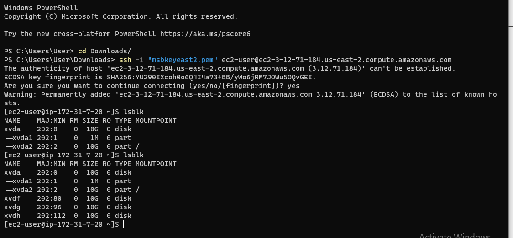**

**Use gdisk utility to create a single partition on each of the 3 disks**

**using the command sudo gdisk /dev/xvdf**

****

**using lsblk to confirm the details**

**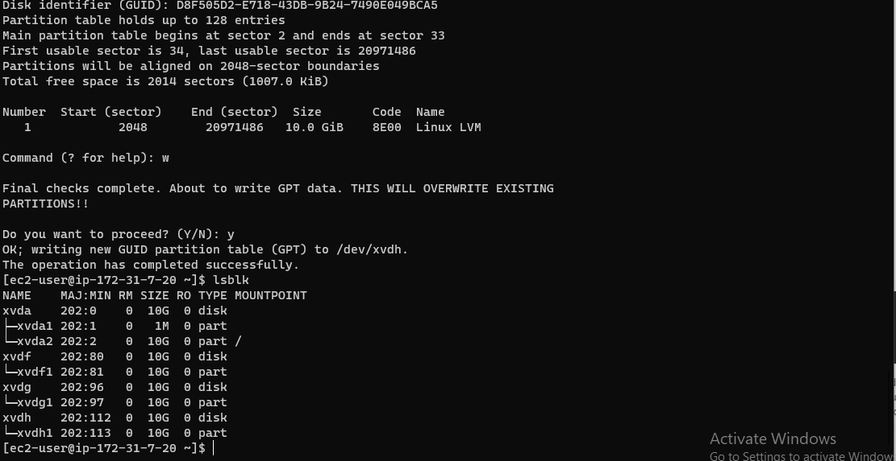**

** Using pvcreate utility to mark each of 3 disks as physical volumes (PVs) to be used by LVM**

**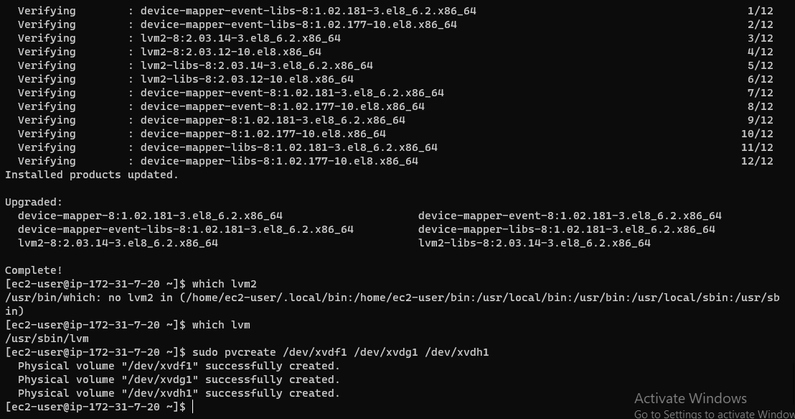**

**Verify that your VG has been created successfully by running sudo vgs**

**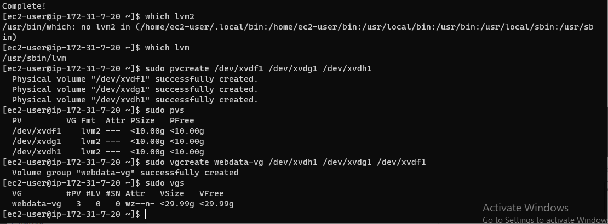**

**using the command to update the webser sudo systemctl daemon-reload**

**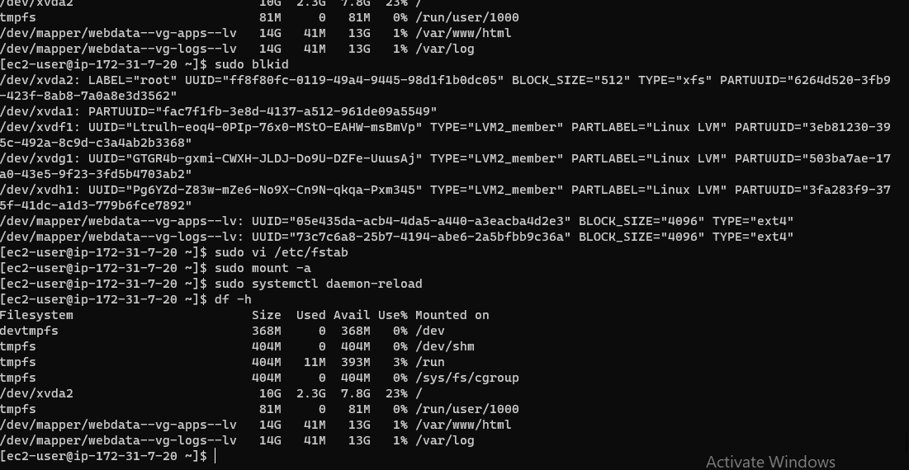**

**Prepare the Database Server**

**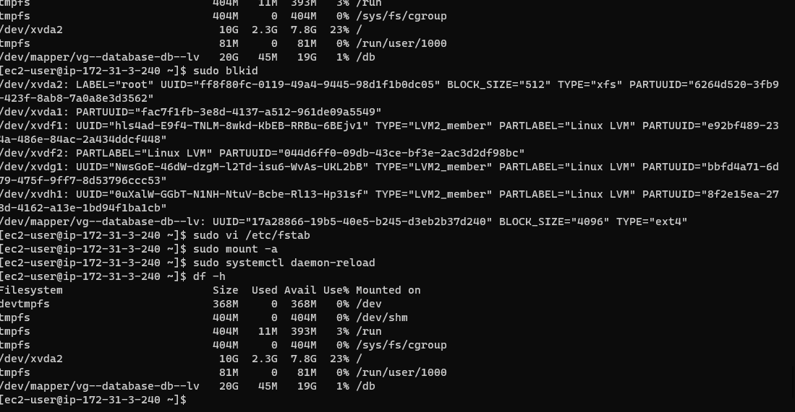**

**httpd running**

**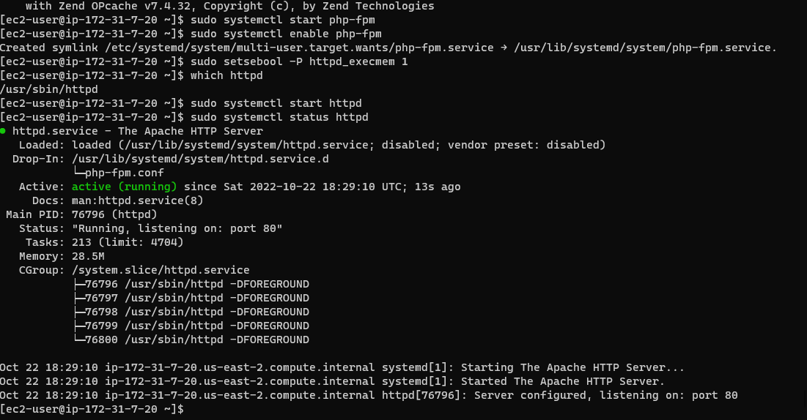**

**Red Hat Enterprise Linux Test page**

**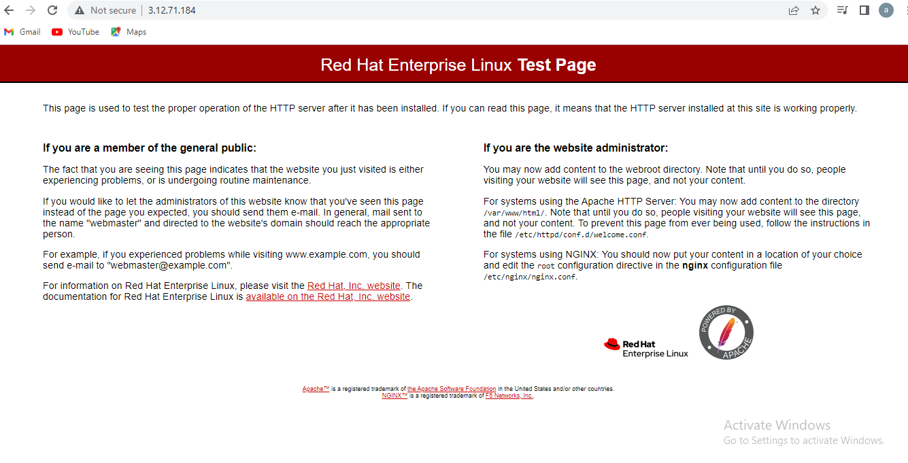**

**Step 4 — Install MySQL on your DB Server EC2**

**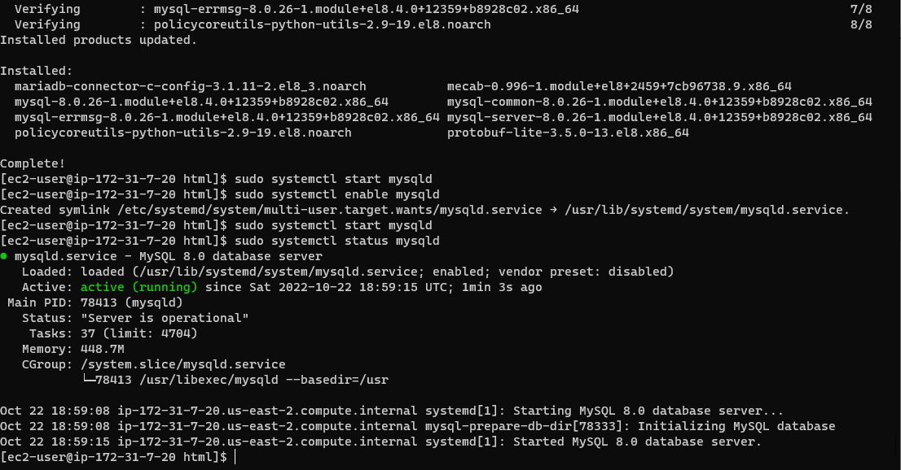**

**Step 5 — Configure DB to work with WordPress**

**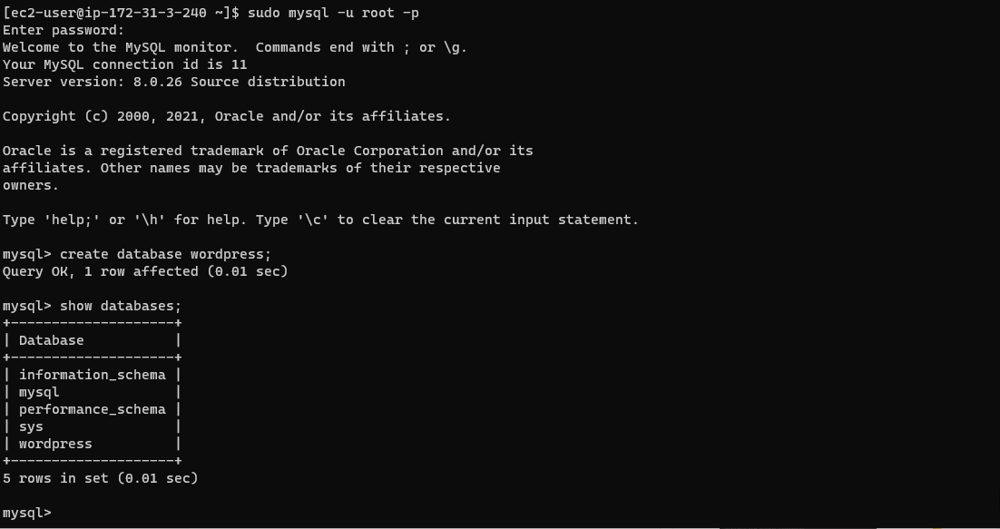**

**WORDPRESS INSTALLED**

**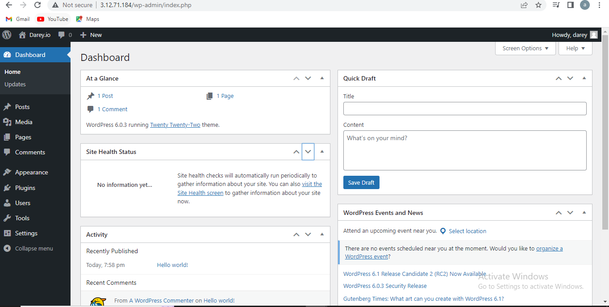**

